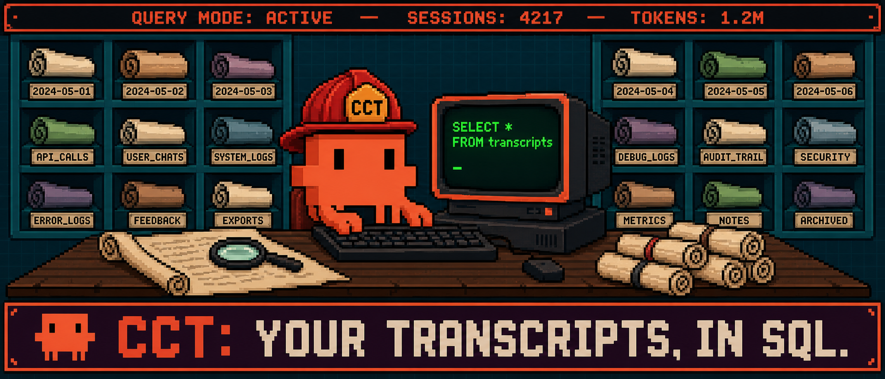

<h1 align="center">cct — Claude Code Transcripts</h1>

<p align="center">
  
</p>

<p align="center">
  <a href="https://github.com/alfredvc/cct/actions/workflows/ci.yml"></a>
  <a href="https://github.com/alfredvc/cct/releases"></a>
  <a href="https://crates.io/crates/claude-code-transcripts-ingest"></a>
  <a href="LICENSE-MIT"></a>
</p>

**Your Claude Code transcripts as SQL.** `cct` ingests every transcript under `~/.claude/projects` into a local DuckDB. Skills tell Claude how to investigate it — so you can ask questions about your own usage in plain English and get answers backed by your real history, not generic advice.

The primitive is the database. The skills are playbooks on top. Cost optimization is one playbook; you can write your own.

## Install

### 1. `cct` binary

```bash
curl -fsSL https://raw.githubusercontent.com/Alfredvc/cct/main/install.sh | sh
```

Downloads the latest prebuilt `cct` binary into `~/.local/bin`. Override with `CCT_INSTALL_DIR=/some/dir` or pin a version with `CCT_VERSION=v0.2.0`. Source: [`crates/claude-code-transcripts-ingest/`](crates/claude-code-transcripts-ingest/).

After install, upgrade in place with `cct update` (or `cct update --version v0.2.0` to pin). `cct` checks GitHub for a newer release once every 24 hours in the background and prints a one-line banner on stderr when one is available. Set `CCT_NO_UPDATE_CHECK=1` (or `CI=true`) to disable. Cache lives at `~/.cache/cct/update_check.json`.

### 2. Skills

```bash
npx skills add alfredvc/cct
```

Installs the agent skills below into Claude Code.

### 3. DuckDB CLI

Skills query the DB via the `duckdb` CLI. Install from [duckdb.org](https://duckdb.org/install/?platform=macos&environment=cli) or:

```bash
curl https://install.duckdb.org | sh
```

## Quickstart

```bash
cct ingest
```

Then ask Claude anything about your usage:

- "What did I spend on Opus last week?"
- "Which sessions had the most cache invalidations?"
- "Show me the 10 most expensive turns and what they were doing."
- "How much is the `frontend-design` skill costing me per invocation?"

Claude picks up the schema from the `cct-db` skill and runs SQL against your local DB.

## Skills

Skills are investigation playbooks. They give Claude the schema, recipes, and methodology to answer specific classes of question. Mix and match — or write your own.

- **`cct-db`** — the foundation. DB schema, common SQL recipes, and guidance for querying transcripts efficiently. Every other skill builds on this.
- **`optimize-usage`** — diagnose Claude Code spend and return a dollar-ranked optimization report. Multi-phase: measure spend categories, inspect raw high-cost turns, disconfirm shallow leads, rank concrete fixes.

Want to investigate something else — tool latency, prompt patterns, error rates, skill ROI? Build a skill on top of `cct-db`. The DB has the data; you write the playbook.

## Tip
If you have a hypothesis about what's driving your usage, just ask Claude. It's good at testing hypotheses with `cct`.

## Explore sessions in the viewer

`cct serve` opens an embedded web viewer at `http://localhost:8766`. Pick a project → session to drill in turn-by-turn.

- **Per-turn cost.** Each assistant turn shows model, timestamp, and dollar cost — with input / cache-read / cache-write / output split as colored bars against the session total.
- **Activity at a glance.** Pills tag what the turn did: thinking, text, tool calls. An activity panel rolls up cost and call count per tool so the budget-eaters stand out.
- **Subagent expansion.** Subagent calls expand inline and lazy-load their full transcript, so you can trace delegated work — and its cost — back to the parent turn that spawned it.
- **Cumulative cost chart.** Area chart above the timeline plots spend over the whole session. Click any dot to jump to and highlight that turn.
- **Session rollup.** Fixed header shows total cost, API call count, and token totals by type.
- **Sort by cost or date.** Session list can sort by most recent or highest spend, so expensive sessions float to the top.

The **Dashboard** tab shows a multi-panel cost breakdown split into two sub-tabs:

- **Overview** — general spend picture: daily spend by model, sessions/week, token-type cost split, model breakdown, errors.
- **Outliers** — actionable panels: most-expensive turns, top sessions, context-size distribution, cache invalidation events, artifact leaderboards, file hotspots, and more.

<p align="center">
  
  <br/>
  <em>Session list — sortable by cost or time, filter on project, tool, model, subagents.</em>
</p>

<p align="center">
  
  <br/>
  <em>Session view — per-turn cost, cache/token split, tool calls and thinking inline.</em>
</p>

<p align="center">
  
  <br/>
  <em>Dashboard — daily spend by model, sessions/week, outlier turns.</em>
</p>

## `cct` reference

Full `cct` reference can be found in [`crates/claude-code-transcripts-ingest/README.md`](crates/claude-code-transcripts-ingest/README.md).

## Workspace

```
crates/claude-code-transcripts/              # typed parser library (no DuckDB)
crates/claude-code-transcripts-ingest/       # `cct` binary (ingest + serve)
crates/claude-code-transcripts-ingest/web/   # embedded React viewer (index.html)
skills/                                      # agent skills (see above)
```

The parser crate ([`claude-code-transcripts`](https://crates.io/crates/claude-code-transcripts)) is independently usable — strongly-typed `Entry` variants and a round-trip validator for catching schema drift.

## Development

- `cargo build` — build workspace
- `cargo test` — unit + integration tests
- `cargo clippy --all-targets --all-features`
- `cargo fmt`
- Pre-commit hook (`.git/hooks/pre-commit`) runs `fmt` + `clippy`

## Release

Releases are driven by [`cargo-release`](https://github.com/crate-ci/cargo-release) locally and the tag-triggered [`release.yml`](.github/workflows/release.yml) workflow in CI.

1. On `main`, bump the shared workspace version:

   ```sh
   cargo release patch --execute    # or minor / major
   ```

   Per [`release.toml`](release.toml) this bumps `Cargo.toml`, commits `chore: release vX.Y.Z`, tags `vX.Y.Z`, and pushes both.

2. Pushing the `vX.Y.Z` tag triggers [`release.yml`](.github/workflows/release.yml), which:
   - Creates a draft GitHub release with auto-generated notes.
   - Builds `cct` binaries for linux/macos × x86_64/aarch64 and uploads tarballs + `.sha256` files.
   - Publishes `claude-code-transcripts`, then `claude-code-transcripts-ingest`, to crates.io.
   - Flips the release from draft to published.

Requirements: `cargo install cargo-release` locally, write access to push tags, and the `CARGO_REGISTRY_TOKEN` repo secret configured.

## License

Dual-licensed under [MIT](LICENSE-MIT) OR [Apache-2.0](LICENSE-APACHE).
